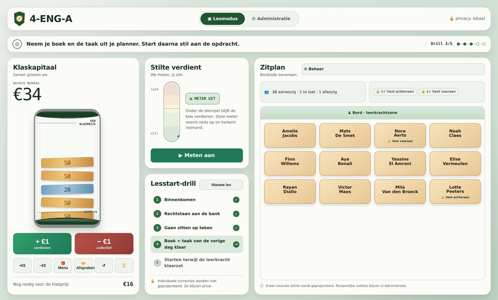

# Klaskompas 🧭

Een **lokaal-eerst** hulpmiddel voor een Vlaamse leerkracht (2e graad secundair,
Engels & Spaans): **klasadministratie** + **visueel klasmanagement** met een
collectief beloningssysteem. Persoonlijk, privacy-by-design, teacher-triggered —
geen server, geen externe datastroom, geen scores of labels per leerling.

## Mappen

| Map | Inhoud | Canon? |
|-----|--------|--------|
| **`app/`** | De werkende web-app (buildless PWA, IndexedDB). Zie [`app/README.md`](app/README.md). | implementatie |
| **`docs/`** | Beslissingen: ADR's, open-beslissingenregister, fiches. | **canon** |
| **`research/`** | Onderzoeksrapporten (klasmanagement, administratie, beloningen). | inspiratie |
| **`prototypes/`** | Vroeg verkennend prototype (opgevolgd door `app/`). | verkenning |
| **`data/`** | Voorbeeld-CSV met fictieve leerlingen. | voorbeeld |

Het projecteerbare **Klasscherm** (Lesmodus):



## Snel starten

```bash
cd app
python3 -m http.server 8000
# open http://127.0.0.1:8000/
```

De app werkt daarna offline en is installeerbaar als PWA. Alle gegevens blijven
lokaal op het toestel.

## Beslissingen (ADR's)

- [ADR-0001](docs/adr/0001-klaskapitaal-en-visueel-klasmanagement.md) — klaskapitaal-economie & visueel klasmanagement
- [ADR-0002](docs/adr/0002-app-fundament-en-administratie.md) — app-fundament & administratie-structuur
- [ADR-0003](docs/adr/0003-beloningsmenu-en-uitgeefmechaniek.md) — beloningsmenu & uitgeef-mechaniek

Openstaande punten staan in [`docs/00-project/OPEN_DECISIONS_REGISTER.md`](docs/00-project/OPEN_DECISIONS_REGISTER.md).

> Klaskompas vervangt geen schoolprocedures. Schoolreglement, pedagogisch project en
> DPO/ICT-afspraken staan boven dit hulpmiddel.
